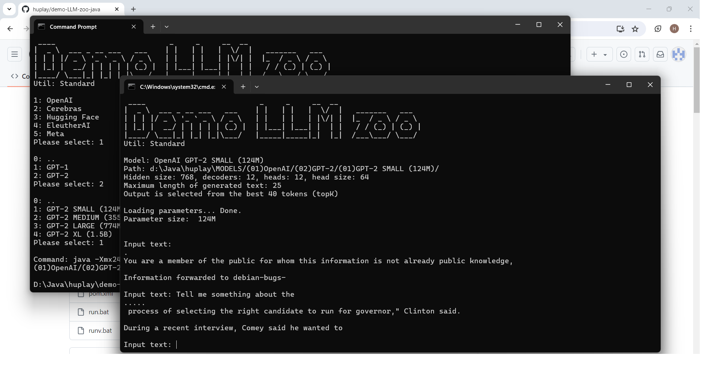
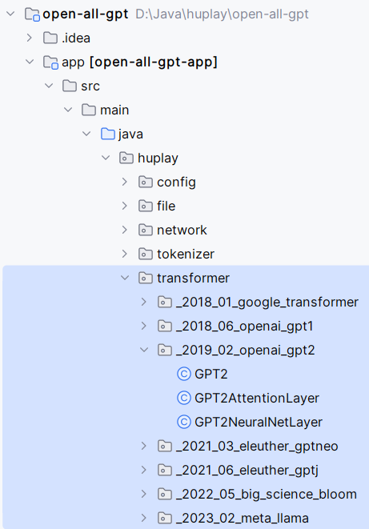
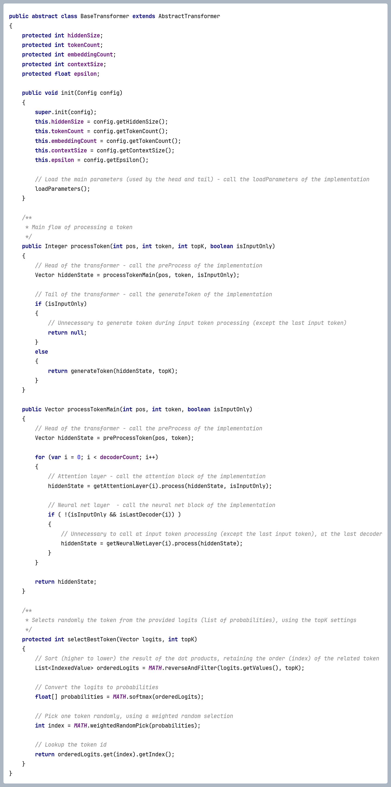
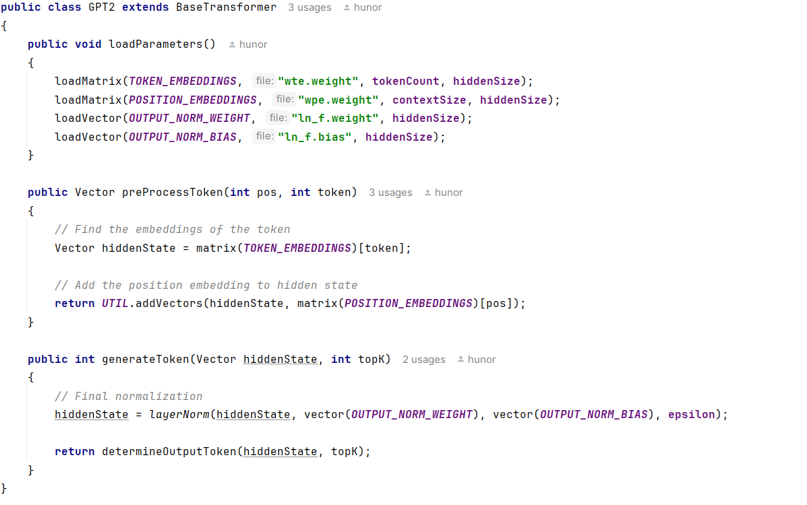
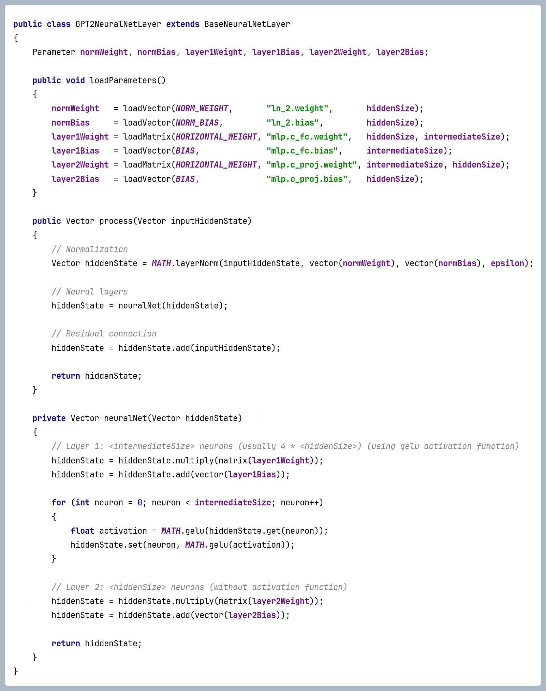

# Open All GPT

This is a demo application which implements different large language models in Java for learning purposes.

The main goal is to demonstrate the different decoder-only transformer architectures (without training), not to create an optimized application.

The second goal was to be able to execute as many models as possible. But it is limited by the operative memory, so I created a network framework which can split the task for multiple computers.

There's no parallel execution, so it is only a demonstration (and test) whether the used algorithm is correct for larger models.

The core transformers architecture is implemented multiple times for different models. The differences are mostly small, so it would be possible to make a single, more general implementation, but then handling the differences would occupy most of the code, so the separate implementations are more clear. Additionally, you can easily compare these, and at the beginning of the code I listed the differences in comments. 

The core mathematical utility is implemented in three versions. There's a `standard` variant, which calculates everything using the simplest way. But I added an `ND4J` and a `Vector-API` implementation also, which can help a little bit to make the inference faster.

There's a standalone version, which has a text-only user interface (in console). But there's a network framework which consists of a server, one or more workers, and a client. The client has a text-only and a web based variant. So it is possible to try the inference from a browser, or even using a mobile phone.

<p align="center"></p>

## Install ##

1. Download and unzip this module: https://github.com/huplay/open-all-gpt

   (Or using git: ```git clone https://github.com/huplay/open-all-gpt.git```)

2. Install Java. (Version 21 or above)

## Run - Standalone mode ##

Using a command line tool (`cmd`) enter into the main directory:

   ```cd open-all-gpt```

   And start the app:

   ```run``` (On Windows)

This will open the `Launcher` app where the user can select the model. It opens the `Main` app which actually processes the user queries. (It was necessary to change dynamically the available memory.) 

## Run - Network mode ##

To use the network feature you have to start the `Server` app one or more `Worker` apps as well. These apps can run on different machines. (You can specify which ports the Server and Worker instances should listen. And on the Worker apps you have to tell the IP address of the Server.)

When the `Server` (`server.bat`) and `Worker` (`worker.bat`) nodes are running you can launch the `Client` (`client.bat`) which connects to the `Server`.

There's a `netrun.bat` to start a server, workers and the client. But for a real use you should use one worker per machine, configured to use as many heap memory as available.

You can use a browser instead of the text-based client, just target the server ip and port, using an url like this: 

   `http://serverhost:port/open-all-gpt`

## Usage (Standalone version) ##

Actually there are two applications. The launcher app implements the model selection, which opens the main app in a separate window.

It is necessary to set the correct heap size (memory) for the main app, which depends on the selected model.

The main app shows a prompt, where you can provide a text:

```Input text:```

You can leave it empty, or type something, which will be continued by the system. While the input tokens are processed a `.` character is displayed. (One for every token.)
After that the system prints the generated tokens (one by one). If the maximum length is reached, or the response finished by an `END-OF-TEXT` token, a new prompt will be given.

Normally every prompt starts a completely new session (the state is cleared), but if you want to remain in the same context, start your input text by `+`.
If you use only a single `+` character, without more content, the system will continue the text as it would do without the limit of the max length.

To quit press Ctrl + C.

If the response contained special unicode characters, where a single character is constructed using multiple tokens, then the "one by one" printing solution will show "?" characters. But after the text is fully generated the whole text will be printed again to show the correct characters. (Only at cases when the original print wasn't perfect.)

## Trained parameters ##

The parameter files should be in `safetensors` format. The app can download these from the configured repository.

Above the 32-bit float (which is the same as the standard Java float), 16-bit float values are also supported. (FLOAT16 and BFLOAT16). There's no 16-bit float data type in Java, so those parameters are converted to Java short, which is an integer data type in theory, but with a conversion trick it can be used. This conversion needs extra computation, but at least it doesn't occupy more memory than necessary. (At calculation, we always use 32-bit float arithmetic.)

## Model configuration ##

Every ported model has a subfolder within the `models` folder. (Organised in subfolders.)

The relative path (separated by the `/` character) will be the `modelId`, for example: `OpenAI/GPT-2/LARGE`.

Every model should have two files to configure the model itself and the tokenizer:

`model.json` format:
- `name`: The name of the model
- `date`: The release date of the model
- `transformerType`: The type of the transformers as it is listed in TransformerType.java
- `repo`: The url of the repo to download the model files (GitHub or Hugging Face repo name, or a url which should work appending the fileName)
- `branch`: The branch name of the repo (at GitHub (default "master") or Hugging Face (default "main"))
- `files`: list of necessary files. If some of these are missing it will be downloaded from the repo
- `parameterNaming`: The format of the transformers parameters (outside of decoders). The `{name}` will be replaced by the name used in the code
- `decoderParameterNaming`: The format of the transformers parameter at decoders. The `{decoderId}` will be replaced by the index of the decoder, the `{name}" by the name used in the code
- `memorySize`: The recommended minimum memory size to load the model
- `configOverride`: In the rare cases there's no `config.json` provided in the repo it is possible to give the parameters here
- `quantization`: Quantization config, see later at quantization

`tokenizer.json` format:
- `tokenizerType`: The type of the tokenizer as it is listed in TokenizerType.java
- `repo`: The url of the repo to download the model files (GitHub or Hugging Face repo name, or a url which should work appending the fileName)
- `branch`: The branch name of the repo (at GitHub (default "master") or Hugging Face (default "main"))
- `files`: list of necessary files. If some of these are missing it will be downloaded from the repo

The `tranformerType` and `tokenizerType` values are necessary, all other values are optional.

It is possible to provide a `folders.json` file in the parent folders tell the recommended displaying order or to make a model disabled.

## Supported Transformer types ##

The Transformer implementations can be found in the `transformers` package. Path: `app/src/main/java/huplay/transformers`.

Every transformers is implemented via three classes. The main is a subclass of the `BaseTransformer`, the attention block implementation is a subclass of `BaseAttentionLayer` and the neural net block is a `BaseNeuralNetLayer`.

There is no logic in the base classes, these are just helpers to store and access the configuration, the parameters and so on.

The following transformers architectures are implemented:

- `ORIGINAL_TRANSFORMER`: The first transformers, created by Google Brain in 2017. Described in the `Attention Is All You Need` paper. (The trained parameters are not published.)
- `OPENAI_GPT_1`: The first GPT created by OpenAI, released in June 2018. (Based on the Google's unpublished model, described in the `Attention Is All You Need` paper)
- `OPENAI_GPT_2`: The second GPT created by OpenAI, limited release in Feb 2019, full access in Nov 2019. Minor differences to GPT-1, only related to the normalization.
- `OPENAI_GPT_3`: The third GPT created by OpenAI, announced in May 2020, without public access. Minor difference to GPT-2 is the sparse attention.
- `ELEUTHERAI_GPT_NEO`: First GPT implementation by EleutherAI, released in March 2021. Almost the same as GPT-2 and GPT-3, few unimportant differences.
- `ELEUTHERAI_GPT_J`: Second GPT implementation by EleutherAI, released in June 2021. First model with Rotary Position Embedding (RoPE), and other details also diverged from the previous models.
- `ELEUTHERAI_GPT_NEOX`: Third GPT implementation by EleutherAI, released in Feb 2022. More similar to the original transformers than GPT-J, but it is also uses rotary position embedding.
- `BIG_SCIENCE_BLOOM`: Created by an open community organised by Hugging Face to create a similar model to GPT-3. Released in March-July 2022. The main difference to GPT-2/GPT-3 is the Alibi position embedding.
- `META_FAIRSEQ`: Fairseq toolkit created by FAIR (Meta AI), used for research projects, first one was published in Sep 2018. (Before GPT-2)
- `META_OPT`: Created by Meta (Facebook), released in May 2022.
- `META_LLAMA`: Created by Meta (Facebook), released in Feb 2023. Currently only the original architecture is supported, but the latest models use Grouped Query Attention. Changes to GPT-2: Rotary position embedding, 3 layered MLP block, Swiglu activation function, RSM normalization.
- `MISTRALAI_MISTRAL`: Created by MistralAI, released in Sep 2023. Almost identical to Llama, but uses different position embedding.
- `GOOGLE_GEMMA`: Created by Google, released in Feb 2024. Almost identical to the Llama architecture.

## Comparison of the models ##

| Name        |  Pos.   |   Att.   | Bias | V | Q | S | G | Act  | P | Norm | E |      Type | U |    | 
|:------------|:-------:|:--------:|------|---|---|---|---|:----:|---|------|---|----------:|---|----|
| Transformer |  Sinus  |   MHA    | XXX  |   | ? | X |   | ReLU |   | Std. |   |       F32 |   |    |  
| GPT-1       | Learned |   MHA    | XXX  |   | X | X |   | GELU |   | Std. |   |       F32 |   |    |
| Fairseq     |  Sinus  |   MHA    | XXX  | X | * |   |   |  *   | X | Std. |   |  F32, F16 | X |    |
| GPT-2       | Learned |   MHA    | XXX  |   | X | X |   | GELU | X | Std. |   |       F32 |   |    |
| GPT-3       | Learned | MHA sp.  | XXX  | * | ? | X |   | GELU | X | Std. |   |       F32 |   |    |
| GPT-Neo     | Learned | MHA sp.  | -XX  | X |   |   |   | GELU | X | Std. |   |       F32 |   |    |
| GPT-J       | RoPE i. |   MHA    | --X  | X |   |   |   | GELU | X | Std. |   |       F32 | X | *1 |
| GPT-NeoX    | RoPE s. |   MHA    | XXX  | X | X | X |   | GELU | X | Std. |   |       F16 | X |    |
| OPT-350     | Learned |   MHA    | XXX  | X |   | Q |   | ReLU |   | Std. |   |       F16 |   | *2 |
| OPT         | Learned |   MHA    | XXX  | X |   | Q |   | ReLU | X | Std. |   |       F16 |   |    |
| Bloom       |  ALiBi  |   MHA    | XXX  | X | X | X |   | GELU | X | Std. | X | F16, BF16 |   |    |
| Llama 1     | RoPE i. |   MHA    | ---  | X |   | X | X | SiLU | X | RMS  |   |       F16 |   |    |
| Llama 2     | RoPE i. | MHA, GQA | ---  | X |   | X | X | SiLU | X | RMS  |   |       F16 |   |    |
| Llama 3     | RoPE i. |   GQA    | ---  | X |   | X | X | SiLU | X | RMS  |   |      BF16 |   |    |
| Falcon      | RoPE ?  | MQA, GQA | ---  | X | ? | ? |   | GELU | X | Std. |   |      BF16 |   | *1 |
| Mistral     | RoPE i. | GQA sp.  | ---  | X |   | X | X | SiLU | X | RMS  |   |      BF16 | X |    |
| Gemma       | RoPE s. | MQA, MHA | ---  | X |   | X | X | GELU | X | RMS* | X |      BF16 |   |    |
| Gemma 2     | RoPE s. | GQA sp.  | ---  | X |   | X | X | GELU | X | RMS* | X |      BF16 |   |    |

Legend:
- `Pos.` : Position embedding type. (Sinusoid / Learned/ RoPE (interleaved or sliced) / ALiBi)
- `Att`: Attention organisation type (MHA: Multi-Head / GQA: Grouped Query /MQA: Multi-Query) (sp. = Sparse)
- `Bias`: Whether bias is used, or only weight (Query-key-value/attention projection/neural net layer)
- `V`: Weights are organised vertically (not horizontally) 
  - (`*` GPT-3 is most likely vertical (more efficient to calculate), but not released, and my implementation is horizontal to make it compatible with GPT-2)
- `Q`: Query, key and value matrices are stored in a single matrix
  - (`?`: Not known, but I implemented as a single matrix to make it compatible with GPT-2; `*`: Single and split also supported)
- `S`: Attention scaling (X: multiplication by 1 / sqrt(head size) / Q: same, but applied on query)
- `G`: Uses gated neural net block (not the standard 2 layered)
- `Act`: Activation function (`ReLU`, `GELU`, `SiLU` (= SwiGLU), `*`: ReLU and GELU also supported)
- `P`: Pre-normalization (with final normalization) (Not post-normalization)
- `Norm`: Normalization type (Std. = Standard layernorm / RMS ("*": +1 offset)
- `E`: Extra input normalization
- `Type`: Data type. (F32: Float 32, F16: Float 16, BF16: Brain Float 16)
- `U`: Untied embedding. There are separate matrices for input embedding and to generate the logits.
- Comments
  - *1 (GPT-J, Falcon): Attention and neural net layer is organised parallel
  - *2 (OPT-350): Extra embedding projection

## Transformer implementation ##

My main goal was to demonstrate the exact steps of the transformers architecture, so I wanted to create the most readable code, without any complex structures. At least at the core part. It's not only for Java developers, not only for developers!

The transformers architecture is implemented multiple times. All variant placed in a separate package within the `transformers` package as you can see highlighted in the image below:

<p align="center"></p>

Every package name contains the release date (and the company), so these are ordered historically.

I tried to write the simplest Java code as possible. My main goal is that 

All of these are very similar, containing three Java classes:

- Main class (`GPT.java`)
- Attention layer class (First block of a decoder, `GPT2AttentionLayer.java`)
- Neural net layer class (Second block of a decoder, `GPT2NeuralNetLayer.java`)

The transformers architecture has a frame, and within that a series of decoders. The frame is implemented in the Main class, the decoder is in two classes, because every decoder has two blocks, an attention and a neural net (MLP) block.

Methods:

Main:
- `loadParameters()`: Loads the main parameters into memory. This is called once, before the inference.
- `preProcessToken()`: This is the beginning of the execution. Accepts a token and executes the pre process steps, like position embedding and normalization
- //// The stack of decoders are called between the preProcessToken() and generateToken() ////
- `generateToken()`: This is the end of the execution. Accepts the result of the decoder stack and generates a token.

Attention layer:
- `loadParameters()`: Loads the parameters for this block into memory. This is called once, before the inference.
- `process()`: The frame of the attention block. Contains normalization, residual connection and calls the attention implementation.
- `attention()`: The implementation of the attention mechanism.

Neural net layer:
- `loadParameters()`: Loads the parameters for this block into memory. This is called once, before the inference.
- `process()`: The frame of the neural net (MLP) block. Contains normalization, residual connection and calls the core neural net implementation.
- `neuralNet()`: The implementation of the core neural net layers.

If you take a look you can see all methods are very simple, only the attention mechanism is more complicated. Although, these uses some inherited methods from the parent (base) classes, and utility methods implementing the core mathematical algorithms, but those are also very simple codes, and everything is included in this repo.

The common core of the transformers implementations:



Code of a main class (GPT-2):



Code of an attention block (GPT-2):


Code of a neural net block (GPT-2):



## Quantization ##

Quantized models are also supported. The app can load models in quantized format, which will be stored in a special matrix object, occupying as less memory as possible. The values will be de-quantized when accessed, so the intermediate objects (created as a result of a calculation) will use FLOAT 32 values, but most of it will be removed by the garbage collector, so it will be in the memory only temporarily, not permanently as the quantized parameters.

Not only the de-quantization is possible, this app can quantize a non-quantized model on the fly (during the load). Furthermore, that is also possible to de-quantize an already quantized model. (The quantization and de-quantization happens only in-memory, it isn't saved.)

To load a quantized model the `model.config` file should contain a `quantization` section:
- `quantizationType`: The name of the quantization method (QLORA or GPTQ)
- `outputFloatType`: The float type used when the values are unpacked. (FLOAT32/FLOAT16/BFLOAT16)
- `parameters`: List of parameters where the quantization happened. If it is missing the WEIGHT parameters are expected to be quantized
- `naming`: Mappings (key-value pairs) to override the default parameter names
- `deQuantizeOnLoad`: Set to true to de-quantize the model at load. It will lost its advantage to occupy less memory, and the performance remains degraded, but if the memory size isn't a problem, the execution will be faster.

The `naming` mapping can contain placeholders:
- `{name}` will be replaced by the final name of the parameter.
- `{name-1}` will be replaced by the final name of the parameter, but the last segment removed (segments are separated by '.').

For example:

"quantization":
{
    "quantizationType": "LLM_INT_8",
    "outputFloatType": "FLOAT_16"
}

To quantize at load a non-quantized model, the `model.config` should contain a `quantize` section:
- `quantizationType`: The name of the quantization method (QLORA or GPTQ)
- `outputFloatType`: The float type used when the values are unpacked. (FLOAT32/FLOAT16/BFLOAT16)
- `config`: Configuration of the specific quantization method

For example:

"quantize": {
    "quantizationType": "QLoRA",
    "outputFloatType": "FLOAT_16",
    "config": {
        "variant": "nf4",
        "blockSize": 128,
        "nestedBlockSize": 256,
        "nestedOffset": 1.0
    }
}

Supported quantization methods:

### LLM.int8() ###
This is an 8-bit quantization method. (One of the first used at LLMs.)
The values are quantized using a simple interpolation, so in practice every value is rounded to the nearest of 256 possible values. (Grouped by rows.)

### QLoRA ###
It is one of the first 4-bit quantization method used at LLMs.
It also uses a simple interpolation, but it has only 16 possible values. The same team implemented it which created the LLM.int8(), but there are some differences. It uses smaller groups (not a whole row), and it has different variants, like `fp4` or `nf4`, etc. (With or without double quantization.) 

The variant type is automatically determined at load. But you have to specify when the quantization is requested. 

- Default parameter names:
    - `absMax`: `{name}.absmax` (The FLOAT 32 absMax values at simple quantization)
    - `quantMap`: `{name}.quant_map` (The quantiles used at quantization)
    - `nestedAbsMax`: `{name}.nested_absmax` (The nested absMax values at double quantization, so the absMaxes of the absMaxes)
    - `nestedQuantMap`: `{name}.nested_quant_map"` (The quantiles used at double quantization for the absMaxes)
    - `quantizedAbsMax`: `{name}.absmax` (The quantized absMax values at double quantization)

### GPTQ ###
(In progress)

- The `quantize.json` file should be added to the `files` list at the `model.json` to download it with the other files
- Default parameter names:
    - `groupIndex`: `{name-1}.g_idx`
    - `zeros`: `{name-1}.qzeros`
    - `scales`: `{name-1}.scales`
    - `weights`: `{name-1}.qweight`

## Rebuild ##

Steps is you want to modify and rebuild the app:

1. Install Maven. (Java compile/build tool) (3.8.6 used during development).

2. Compile (build) the application. There are 3 possibilities, based on that which utility implementation you want to use.
   Standard: 

   ```mvn clean install```

   (This is equivalent to ```mvn clean install -Pstandard```)

   Using Nd4j:

   ```mvn clean install -Pnd4j```

   Using Java Vector API:

   ```mvn clean install -Pvector-api```


## Customization ##

At default the parameter files are downloaded to the `download` folder. You can specify a different folder using the ```OPEN_ALL_GPT_DOWNLOAD_ROOT``` environment variable.

Without using the menu, you can directly select the model, where the ```<model-name>``` is the full path within the model root:

   ```run <model-name>``` (On Windows)
    
Or on any systems:```java -jar target/open-all-gpt.jar <model-name>```

(To specify the order the folders has a (nn) prefix, which is removed when the folder name is displayed, but it is part of the model path.)

If you want to use the Vector API version (in the case you installed that variant) you have to use the ``runv <model-name>`` command.
This is necessary because the Vector API isn't ready (as of Java 20), added only as an incubator module, so we have to execute the Java Virtual Machine telling we want to use this incubator feature. 
  
## Additional command line parameters (Standalone version) ##

- `-max` - Maximum number of generated tokens (default: 25)
- `-topK` - Number of possibilities to chose from as next token (default: 40)
- `-calc` - Calculation only (without executing the model, it just displays the parameter size)

Example:

`run GPT2/XL -max=1024 -topk=100`

## Tokenizer ##

All LLMs use a byte pair encoding logic, but there are different versions.

Supported tokenizers: 
   - GPT-1
   - GPT-2 (used by GPT-3 as well), and for BLOOM with different vocabulary
   - SentencePiece (used by Llama1 and Llama2)

| Name        | Tokenizer     | No. tokens |
|:------------|---------------|-----------:|
| Transformer | BPE           |     32,000 |
| GPT-1       | GPT-1         |     40,478 |
| GPT-2       | GPT-2         |     50,256 |
| GPT-3       | GPT-2         |     50,256 |
| GPT-NEO     | GPT-2         |     50,256 |
| GPT-J       | GPT-2         |     50,400 |
| GPT-NEOX    | GPT-2         |     50,432 |
| OPT         | GPT-2         |     50,272 |
| BLOOM       | GPT-2         |    250,880 |
| Llama 1     | SentencePiece |     32,000 |
| Llama 2     | SentencePiece |     32,000 |
| Llama 3     | TikToken      |    128,256 |
| Mistral     | SentencePiece |     32,000 |
| Gemma       | SentencePiece |    256,000 |


## Some comments about the implementation ##

As I mentioned earlier, my main goal was to create a clean, readable code. Especially at the core parts. I look it as a language-agnostic pseudocode, not a cutting edge Java implementation.

That's why I avoided to use generics, lambda expressions or any special language features in the transformers implementations. There's no parallelism and I removed every unnecessary modifiers. I even avoided to use constructors here. It would be possible to remove some type declarations as well (using only the "var" keyword), but I found that, declaring the type is possibly against the readability, but helps to understand the code. You can see always what kind of variable you are looking. (This is one thing that makes a Python code difficult to read. You have no idea what is a particular variable. Is it a number? A list? A tensor? Or something completely different?)

I used the latest language features outside of the transformers package, so it's not an outdated, ugly Java code. I'm a professional Java developer. :-). But I preferred to use the least complicated implementation, which helps even an outsider to understand what is happening.

The second goal was to be able to launch as many models as possible. Recently, the main bottleneck is the memory usage. We have to load billions of parameters into the memory. At the older models every parameter was stored in 4 bytes. How to load a model with tens of billions of parameters? Or hundreds? And where is the end? In theory, virtual memory could help, but it slows down the execution extremely, so in practice it isn't a good idea. (All the parameters are needed to process every token, so it's a huge amount of swapping from memory to disk and vice-versa.)

To overcome on this problem, the first trick was to use 16-bit float values. At bigger models (above GPT-2) almost everybody moved to this direction. But in the recent programming languages there's no 16-bit float type, only 32 or 64 floats are available. This is a relatively new demand. (It's not only a Java issue, there's no native 16-bit floating point data type in Python or in C.) You can manage it somehow, using dedicated frameworks or little tricks, but the built-in functionality isn't enough. Instead of using the standard float arrays, I had to wrap my values into something, so I created the Vector and Matrix classes to hold 16-bit values without extra memory consumption. (In data types not designed to hold float values.) It needs some extra computation, but you won't run out of memory as quickly. And the use of wrapper classes allowed me to support the quantization. Which also helps to reduce the memory consumption. So it was a good opportunity to discover and show the different quantization methods!

Not only the high-level transformers logic is implemented here, but every little step to compute a neural network, or process normalization, calculate softmax, etc. I wanted to create a mathematical utility which has no dependencies on external frameworks and as simple as possible. This is the MathUtility in the standard module. The ND4J and the Vector-API implementations are just extra alternatives, a little play with these technologies which can help to execute the calculation faster. 

The networking is also a not-necessary plus, but it can help to launch bigger models, which would be impossible on a single computer. To be able to split the tasks and to use the most available memory on all computers, I separated the attention and neural net blocks, so a decoder is implemented in two parts. Additionally, I had to create a structure where the different kind of parameters can be loaded independently/optionally. One computer can load only the main parameters, used by the frame (head and tail of the transformers), another computer can load few decoders, and maybe for the first decoder only the neural net block, for the last only the attention block will be used. The implementation was simpler without this possibility, but it also resulted in a shorter code at those three classes, because I had to move the wiring to a different class (to the parent classes), so it's maybe not only a good compromise, but something which helps the readability of the main parts.

